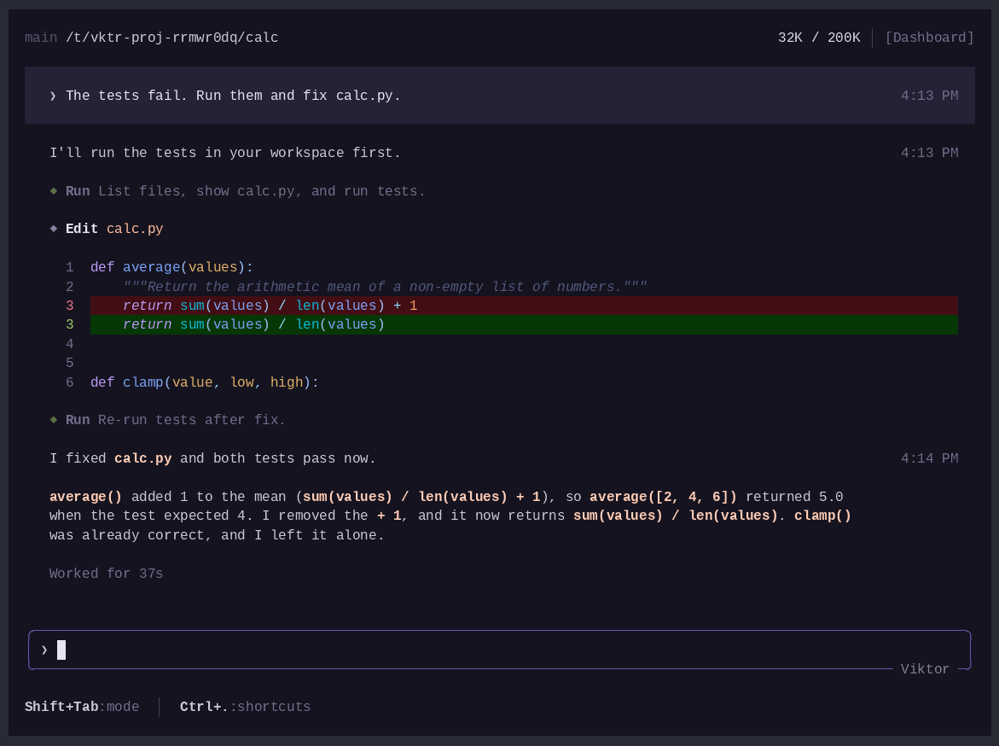

# vktr

**vktr is a fork of [Grok Build](https://github.com/xai-org/grok-build), xAI's open-source terminal
coding agent, with a few extensions on top and its own look.** It is maintained by
[viktor.com](https://viktor.com), uses [Viktor](https://viktor.com) as its built-in model, and
otherwise works the way Grok Build does.

<p align="center">
  
</p>

To install it, ask your coding agent: *"Install vktr from github.com/viktor-com/vktr and set it up for
me."* It needs a Viktor API key with the `chat:completions` scope. Then run `vktr` in a project.

### What vktr adds to Grok Build

- **Viktor as the built-in provider.** One model, `viktor`, signed in with an API key (no browser
  login). Each session keeps one Viktor thread, across restarts, `--continue` and `--resume`.
- **Editors.** `vktr acp` serves Viktor to Zed, JetBrains and other Agent Client Protocol clients,
  with the editor's own permission prompts and the editor's MCP servers.
- **Other coding tools.** `vktr launch` runs Claude Code, Codex, opencode, pi and others against
  Viktor or a local OpenAI-compatible backend, without touching their config.
- **Scripting.** `vktr -p` takes piped input, and a tool call it had to deny exits non-zero with
  the call named, instead of stopping silently.
- **Cheaper requests.** A leaner default toolset, and one model request per prompt: titles,
  summaries, recaps and suggestions are opt-in.
- **No xAI traffic.** No xAI login, telemetry, self-update or request headers.
- **Visuals.** The Viktor wordmark as pixel art on the welcome screen, the Viktor gradient on the
  spinner and welcome box, and vktr Night and vktr Day themes in the Viktor brand colours.

Everything else (the TUI, tools, permissions, sandbox, sessions, MCP, skills, plugins, hooks) is
upstream Grok Build. The full list of changes is in [`CHANGELOG.md`](CHANGELOG.md).

<p align="center">
  
</p>

---

## For agents

This section is everything you need to install, configure and use vktr, and to work on this
repository. Use `vktr -p` for your own tasks and leave the interactive TUI (`vktr` with no `-p`)
to the human: it needs a real terminal and a person at the keyboard.

### 1. Install

```bash
curl -fsSL https://raw.githubusercontent.com/viktor-com/vktr/main/install.sh | sh
vktr --version        # e.g. "vktr 1.0.38-vktr.2 (<commit>)"
```

- Needs no root. The binary goes to `~/.vktr/bin` (`VKTR_INSTALL_DIR`), linked from
  `~/.local/bin` (`VKTR_BIN_DIR`). If `vktr` is not found afterwards, `~/.local/bin` is missing from
  `PATH`: tell the human, or call `~/.vktr/bin/vktr` directly.
- Targets: Linux x86_64 and aarch64 (glibc 2.28 or newer) and macOS 11 or newer on Apple Silicon.
  Anything else (Intel Mac, musl, Windows) has no build: stop and say so, or build from source (below).
- Downloads are checked against their `.sha256`; a release without one is refused.
- `sh install.sh --version <tag>` pins a release. The default is the newest non-prerelease.
- **Update:** `vktr update --check --json` reports whether a newer release exists; rerun the
  installer to update. vktr never updates itself.
- **Uninstall:** delete `~/.vktr/bin/vktr` and the `~/.local/bin/vktr` link. `~/.vktr` also holds
  the config, saved key and sessions; delete it only if the human asks.

### 2. Authenticate

vktr needs a Viktor API key (format `zt_live_sk_…`, scope `chat:completions`). Ask the human for
it; never invent or search for one.

- **For one process:** export `VIKTOR_API_KEY`. It takes precedence over a saved key.
- **To persist it:** pipe it to `vktr login`, which verifies the key and then saves it to
  `~/.vktr/config.toml` (as `[model.viktor] api_key`):

  ```bash
  printf '%s' "$KEY" | vktr login
  ```

  Prefer stdin or `VKTR_LOGIN_API_KEY` over `vktr login --api-key <key>`, which leaves the key in
  the process list and shell history. `vktr logout` removes it.

`VIKTOR_BASE_URL` points vktr at another Viktor deployment; the default is
`https://api.viktor.com/api/compat/v1`. `vktr doctor` confirms where the key comes from and checks
it against the server.

### 3. Run a task

```bash
vktr -p "Explain this repository"                  # answer on stdout, then exit
git diff | vktr -p "Review this change"            # piped input goes along as context
vktr --prompt-file task.md                         # long prompts from a file (instead of -p)
vktr -p "List the TODOs" --cwd path/to/repo        # run against another directory
```

For machine-readable results:

| Flag | Output |
| --- | --- |
| `--json` | One JSON object: `text`, `stopReason`, `sessionId`, `requestId`, and `usage` when reported |
| `--json-schema '<schema>'` | As `--json`, plus `structuredOutput` matching the schema (or `structuredOutputError`) |
| `--output-format streaming-json` | NDJSON, one Agent Client Protocol session update per line |
| `--output-format streaming-messages-json` | NDJSON in the Anthropic Messages wire format (`--include-partial-messages` adds deltas) |

```bash
vktr -p "Extract the version" --json-schema '{"type":"object","properties":{"version":{"type":"string"}}}'
```

Exit status is 0 on success and 1 on failure, including a run that stopped on a denied tool call.
In plain mode the error goes to stderr as text; in the JSON modes it is a
`{"type":"error","message":…}` object on stdout. Piped stdin that stays idle for 1 s is ignored, so
an inherited but unused pipe does not block the run.

### 4. Project instructions and folder trust

vktr reads `AGENTS.md` (and `CLAUDE.md`) from `~/.vktr/`, the repository root and the current
directory, deeper files taking precedence. A repository's own `AGENTS.md`, `.vktr/config.toml`,
`.mcp.json` and `.vktr/skills` are only loaded once the folder is trusted, because a cloned
repository can ship commands and auto-approve rules in them.

In headless mode nobody can be asked, so an untrusted repository's project files are **skipped
without an error**. Look at them first, then trust the folder once; the decision is saved in
`~/.vktr/trusted_folders.toml`:

```bash
vktr -p "Summarise the build steps" --trust
```

`vktr inspect` shows whether the project is trusted and lists the instructions, permission rules
and skills that are loaded for the current directory.

### 5. Permissions

Headless mode cannot ask anyone for approval. A tool call that needs approval is **denied**: the
disk is left untouched, stderr names the blocked call, and the run exits non-zero. Grant only what
the task needs:

```bash
vktr -p "Fix the failing test" --allow 'Edit' --allow 'Bash(python3 -m unittest*)'
vktr -p "Tidy the imports" --permission-mode acceptEdits      # edits yes, commands still denied
vktr -p "..." --always-approve --deny 'Bash(git push*)'       # everything except what is denied
```

- Without any grant, reads, searches and read-only shell commands still run.
- Rules are `Tool` or `Tool(pattern)`, for example `Edit`, `Read(src/*.rs)`, `Bash(git *)`. A rule
  grants only its own tool family: `--allow 'Edit'` does not allow shell commands. A matching deny
  rule always wins, including over `--always-approve`.
- `--permission-mode` takes `default`, `acceptEdits`, `auto`, `dontAsk`, `bypassPermissions` or
  `plan`; the modes and the full check order are in
  [`22-permissions-and-safety.md`](crates/codegen/xai-grok-pager/docs/user-guide/22-permissions-and-safety.md).
- `--sandbox <profile>` (or `VKTR_SANDBOX`) limits filesystem and network access.
- Use `--always-approve` (the same as `bypassPermissions`) only when the human asked for it or the
  checkout is disposable, and pair it with deny rules for anything that must never run.

### 6. Multi-step work

Sessions are saved per directory, so a task can span several runs:

```bash
id=$(vktr -p "Plan the refactor of parser.rs" --json | jq -r .sessionId)
vktr -p "Now do step 1" --resume "$id" --allow 'Edit'
vktr -p "Run the tests and fix what broke" --continue --allow 'Edit' --allow 'Bash(cargo test*)'
```

- `--continue` (`-c`) picks the most recent session in the current directory; `--resume <id>`
  (`-r`) picks a specific one.
- `--fork-session` branches off without changing the original. `--max-turns <n>` caps a run.
- `vktr sessions` lists and searches sessions, `vktr export` writes one as Markdown, and
  `vktr usage` prints its token and cost usage.
- `--worktree=<name>` runs in a fresh git worktree, so parallel runs do not touch each other's files.
- The default toolset leaves out workflows, subagents, the scheduler and monitors.
  `VKTR_FULL_TOOLSET=1` adds them back; `VKTR_SUBAGENTS=1` or `VKTR_WORKFLOWS=1` adds one family.

### 7. Set up the human's tools

**Editor.** Print the snippet and add it to the editor's settings (Zed:
`~/.config/zed/settings.json`, under `agent_servers`):

```bash
vktr acp --print-config zed          # or: jetbrains
```

`vktr acp` serves Viktor over the Agent Client Protocol on stdio. Reads, writes and commands go
through the editor's own permission prompts, and sessions survive editor restarts. Other editors
and troubleshooting are in [`docs/acp.md`](docs/acp.md).

**Other coding tools.** `vktr launch` runs an installed tool against Viktor or a local
OpenAI-compatible backend, without editing that tool's config. Launch options go before the tool
name; everything after it is passed through.

```bash
vktr launch --viktor claude                            # Claude Code against Viktor
vktr launch --backend ollama --model qwen3.5:4b opencode
vktr launch --config opencode                          # print the wiring, start nothing
```

Supported tools: claude, codex, copilot, grok, hermes, mi, opencode, pi, pool, vktr. If
[Harbor](https://github.com/av/harbor) is installed, local launches go through `harbor launch`.

**MCP servers.** `vktr mcp add` writes to `~/.vktr/config.toml`, or to the project's
`.vktr/config.toml` with `--scope project`; `vktr mcp list` shows both. Reference secrets as
`${VAR}` rather than pasting them into a project config.

```bash
vktr mcp add filesystem -- npx -y @modelcontextprotocol/server-filesystem /path/to/dir
vktr mcp add --transport http sentry https://mcp.sentry.dev/mcp
```

**Other models.** Add any OpenAI-compatible backend to `~/.vktr/config.toml`, then check it with
`vktr models`, and select it with `-m local`:

```toml
[model.local]
model = "qwen3.5:4b"
base_url = "http://localhost:11434/v1"
env_key = "OPENAI_API_KEY"
```

### 8. Check and troubleshoot

| Command | Use |
| --- | --- |
| `vktr --version` | Installed version |
| `vktr doctor` | Key source, endpoint and a live key check; terminal, clipboard, colour and input support for TUI problems |
| `vktr inspect` | The configuration, instructions and servers vktr discovers for this directory |
| `vktr models` | Models available with the current configuration |
| `vktr -p "..." --debug-file /tmp/vktr.log` | Debug log for a failing run |

| Environment | Effect |
| --- | --- |
| `VIKTOR_API_KEY` | API key for this process |
| `VIKTOR_BASE_URL` | Another Viktor deployment |
| `VKTR_HOME` | Config and session directory instead of `~/.vktr` |
| `VKTR_FULL_TOOLSET=1` | Adds the workflow, subagent, scheduler and monitor tools to the default lean toolset |
| `VKTR_SANDBOX` | Default `--sandbox` profile |

| Path | Contents |
| --- | --- |
| `~/.vktr/config.toml` | Models, saved key, MCP servers, settings |
| `~/.vktr/sessions/` | Saved sessions, one directory per working directory |
| `~/.vktr/trusted_folders.toml` | Folder trust decisions |
| `~/.vktr/AGENTS.md` | Instructions for every project |
| `~/.vktr/docs/user-guide/` | Local copy of the user guide |

Plugins (`vktr plugin`) and cross-session memory (`vktr memory`) are managed with their
subcommands; `--help` on any subcommand lists its options. The full user guide (configuration,
headless mode, sessions, sandbox, hooks, custom models) is in
[`crates/codegen/xai-grok-pager/docs/user-guide/`](crates/codegen/xai-grok-pager/docs/user-guide/).

### 9. Working on this repository

Read [`AGENTS.md`](AGENTS.md) first: it covers the `.facts` fact sheet, how behaviour is proven
(`scripts/test.sh`) and how upstream updates are merged.

Requirements are Rust (pinned in `rust-toolchain.toml`; rustup installs it) and
[DotSlash](https://dotslash-cli.com) on `PATH` for the hermetic `protoc`.

```bash
cargo build -p xai-grok-pager-bin --release    # -> target/release/vktr
scripts/test.sh [pattern]                      # targeted cargo tests and mock-Viktor smoke scripts
sh install.sh --from-source                    # build and install from this checkout
```

| Path | Contents |
| --- | --- |
| `crates/codegen/xai-grok-pager-bin` | Composition root; builds the `vktr` binary |
| `crates/codegen/xai-grok-pager` | The TUI and headless mode |
| `crates/codegen/xai-grok-shell` | Agent runtime and ACP entry points |
| `crates/codegen/xai-grok-tools` | Tool implementations |
| `crates/codegen/xai-grok-sampler` | Model backends (chat completions, responses, messages) |
| `crates/codegen/xai-grok-models` | Built-in model catalog (`viktor`) |
| `crates/codegen/vktr-acp` | `vktr acp`: Viktor as an ACP agent for editors |
| `docs/` | ADRs, `acp.md`, [terminal recordings](docs/recordings/README.md) |
| `.facts` | Behavioural spec; `scripts/test.sh` runs the tests behind it |

Upstream crate names are kept as-is so diffs against upstream stay reviewable. Upstream Grok Build
arrives by merge from the `vendor/grok-build-rebranded` branch
([`update-upstream`](.agents/skills/update-upstream/SKILL.md)); never squash or rebase `main` past
those merges.

Releases: pushing a tag `v<version>` runs `.github/workflows/release.yml`. It builds the Linux and
macOS tarballs with `scripts/dist.sh`, stages a draft release, installs that draft on each target
OS and runs `scripts/smoke-release.sh` there, and only then publishes. Running the workflow by hand
does the same as a dry run with a throwaway `dryrun-<run id>` prerelease that is deleted afterwards.

## License

Apache License 2.0. See [`LICENSE`](LICENSE), [`NOTICE`](NOTICE) and
[`THIRD-PARTY-NOTICES`](THIRD-PARTY-NOTICES). Changes are listed in [`CHANGELOG.md`](CHANGELOG.md);
security reports go through [`SECURITY.md`](SECURITY.md).

vktr is a fork of [Grok Build](https://github.com/xai-org/grok-build) maintained by
[viktor.com](https://viktor.com) (background in `docs/adr/0001-base.md`). It is not affiliated
with or endorsed by xAI; "Grok" and "xAI" are their trademarks.
